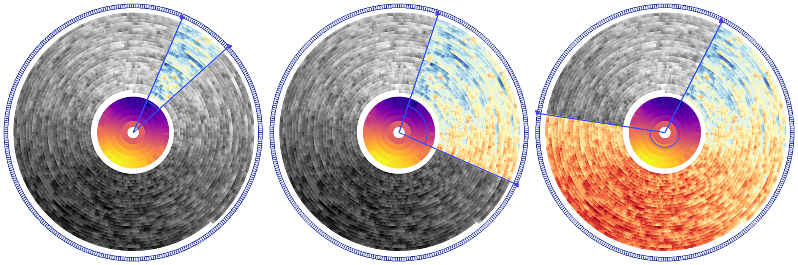

<table align="center"><tr><td align="center" width="9999">

# Interactive Time Series Spiral

[Live Demo](spirale.rakuschek.at)



</td></tr></table>

This repository contains the source code of an interactive time series spiral visualization. 

## Setup
This prototype is a web application designed to run locally.
The only prerequesite to run our prototype is [**NodeJS**](https://nodejs.org/en).
After having installed Node, run the following commands:

```
npm install
npm run dev
```
Your local instance is available at [http://localhost:5173/](http://localhost:5173/).

## License

This project is the outcome of our research and is freely available as open source. You are welcome to use, modify, and share any components from this repository. We would love to hear your feedback or learn how you have incorporated this prototype or its components into your own work.